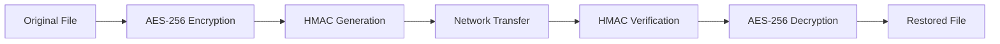

# 🔐 SecureFileTransferApp

<div align="center">

[](https://opensource.org/licenses/MIT)
[](https://www.python.org/)
[](https://github.com/ZeroHack01/SecureFileTransferApp)
[](https://github.com/ZeroHack01/SecureFileTransferApp)
[](https://github.com/ZeroHack01/SecureFileTransferApp/pulls)

**A powerful command-line Python tool for secure, encrypted file transfers across networks**

*Featuring AES-256 encryption and HMAC integrity verification for professionals who demand privacy and security*

[Features](#-features) • [Installation](#-installation) • [Usage](#-usage) • [Security](#-security-overview) • [Contributing](#-contributing)

</div>

---

## 🚀 Features

<table>
<tr>
<td>

### 🔒 **Security First**
- **AES-256 Encryption** - Military-grade end-to-end confidentiality
- **HMAC (SHA-256)** - Cryptographic integrity verification
- **Secure Key Derivation** - SHA-256 passphrase-based key generation

</td>
<td>

### ⚡ **Performance & Usability**
- **Lightweight CLI Interface** - No bloated GUI, pure efficiency
- **Cross-Platform Compatible** - Windows, macOS, Linux support
- **Network Ready** - Built for LAN and secure network environments

</td>
</tr>
</table>

### ✅ Core Capabilities
- 📤 **File Sender Mode** - Host files securely for transfer
- 📥 **File Receiver Mode** - Connect and download encrypted files
- 🔑 **Passphrase Protection** - User-defined encryption keys
- 🛡️ **Zero Plaintext Storage** - Files never stored unencrypted during transfer

---

## 🛠️ Project Structure

```
SecureFileTransferApp/
├── 📄 client.py          # Client-side file receiver
├── 📄 server.py          # Server-side file sender  
├── 🔐 encryption.py      # AES encryption/decryption module
├── ✅ hmac_verify.py     # HMAC integrity functions
├── 🛠️ utils.py           # Key derivation & utility functions
├── 📋 requirements.txt   # Python dependencies
└── 📖 README.md          # This documentation
```

---

## 📦 Installation

### Prerequisites
- Python 3.8 or higher
- pip package manager

### Quick Setup

1. **Clone the repository**
```bash
git clone https://github.com/ZeroHack01/SecureFileTransferApp.git
cd SecureFileTransferApp
```

2. **Create virtual environment** (recommended)
```bash
python3 -m venv venv
source venv/bin/activate  # On Windows: venv\Scripts\activate
```

3. **Install dependencies**
```bash
pip install -r requirements.txt
```

---

## 🔑 Key Generation & Security

The application uses **passphrase-based key derivation** for maximum security:

```python
from utils import derive_key
key = derive_key("your_secure_passphrase")
```

> ⚠️ **Critical Security Note**: Both sender and receiver must use the **identical passphrase** for successful encryption/decryption. Choose a strong, unique passphrase for each transfer session.

### Passphrase Best Practices
- Use at least 12 characters
- Include uppercase, lowercase, numbers, and symbols
- Avoid dictionary words or personal information
- Consider using a passphrase generator

---

## 📡 Usage

### 🖥️ Server (File Sender)

Start the server to host files for secure transfer:

```bash
python server.py --port 4444 --key "your_secure_passphrase"
```

**Parameters:**
- `--port`: Network port to listen on (default: 4444)
- `--key`: Encryption passphrase (must match receiver)

### 💻 Client (File Receiver)

Connect to the server to download encrypted files:

```bash
python client.py --host 192.168.1.100 --port 4444 --key "your_secure_passphrase"
```

**Parameters:**
- `--host`: IP address of the server machine
- `--port`: Network port to connect to (must match server)
- `--key`: Decryption passphrase (must match sender)

### 📋 Example Workflow

1. **On Sender Machine:**
   ```bash
   python server.py --port 4444 --key "MySecurePassphrase123!"
   ```

2. **On Receiver Machine:**
   ```bash
   python client.py --host 192.168.1.100 --port 4444 --key "MySecurePassphrase123!"
   ```

---

## 🛡️ Security Overview

<div align="center">

### 🔐 **End-to-End Encryption Pipeline**



</div>

### Security Features

| Component | Implementation | Purpose |
|-----------|----------------|---------|
| **Encryption** | AES-256 in CBC mode | Confidentiality protection |
| **Initialization Vector** | Cryptographically random IV | Prevents pattern analysis |
| **Integrity Protection** | SHA-256 HMAC | Detects tampering/corruption |
| **Key Derivation** | SHA-256 hash function | Secure passphrase-to-key conversion |
| **Memory Safety** | No plaintext persistence | Prevents data recovery attacks |

### 🔒 Security Guarantees
- **Confidentiality**: Files are encrypted with military-grade AES-256
- **Integrity**: HMAC ensures files haven't been tampered with
- **Authentication**: Passphrase-based access control
- **Forward Security**: Each transfer uses unique initialization vectors

---

## 🧠 Roadmap & Future Enhancements

### 🎯 Planned Features

<table>
<tr>
<td width="50%">

#### 🔄 **Advanced Cryptography**
- [ ] Diffie-Hellman key exchange
- [ ] RSA asymmetric encryption option
- [ ] Perfect Forward Secrecy (PFS)
- [ ] Certificate-based authentication

</td>
<td width="50%">

#### 🚀 **Enhanced Functionality**  
- [ ] Multi-file & directory transfer
- [ ] Real-time progress indicators
- [ ] Transfer resume capability
- [ ] Compression before encryption

</td>
</tr>
<tr>
<td>

#### 🖥️ **User Experience**
- [ ] Cross-platform GUI (Tkinter/PyQt)
- [ ] Web-based interface option
- [ ] Transfer history & logging
- [ ] Configuration file support

</td>
<td>

#### 🌐 **Network & Performance**
- [ ] IPv6 support
- [ ] Bandwidth throttling
- [ ] Multi-threaded transfers
- [ ] UDP option for speed

</td>
</tr>
</table>

---

## 🤝 Contributing

We welcome contributions from the community! Here's how you can help:

### 🐛 **Report Issues**
Found a bug? [Open an issue](https://github.com/ZeroHack01/SecureFileTransferApp/issues) with:
- Detailed description
- Steps to reproduce
- System information
- Expected vs actual behavior

### 💡 **Suggest Features**
Have an idea? [Start a discussion](https://github.com/ZeroHack01/SecureFileTransferApp/discussions) or submit a feature request!

### 🔧 **Submit Pull Requests**
1. Fork the repository
2. Create a feature branch (`git checkout -b feature/amazing-feature`)
3. Commit your changes (`git commit -m 'Add amazing feature'`)
4. Push to the branch (`git push origin feature/amazing-feature`)
5. Open a Pull Request

### 📋 **Development Guidelines**
- Follow PEP 8 style guidelines
- Add unit tests for new features
- Update documentation as needed
- Ensure backward compatibility

---

## 📄 License

This project is licensed under the **MIT License** - see the [LICENSE](LICENSE) file for details.

```
MIT License - You're free to use, modify, and distribute this software
with attribution to the original author.
```

---

## 👨‍💻 Author & Contact

<div align="center">

**Mongwoiching Marma**

[](mailto:mongwoiching2080@gmail.com)
[](https://github.com/ZeroHack01)

*Passionate about cybersecurity, cryptography, and secure software development*

</div>

---

<div align="center">

### 🌟 **Star this repository if you find it useful!** 🌟

**Made with ❤️ for secure file transfers**

[⬆ Back to Top](#-securefiletransferapp)

</div>
